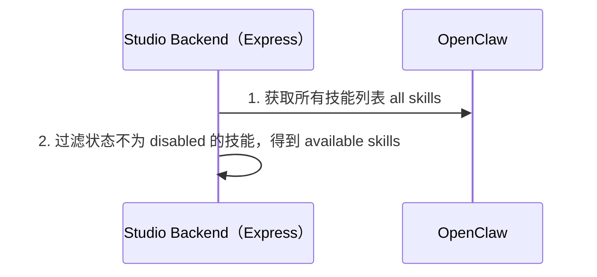
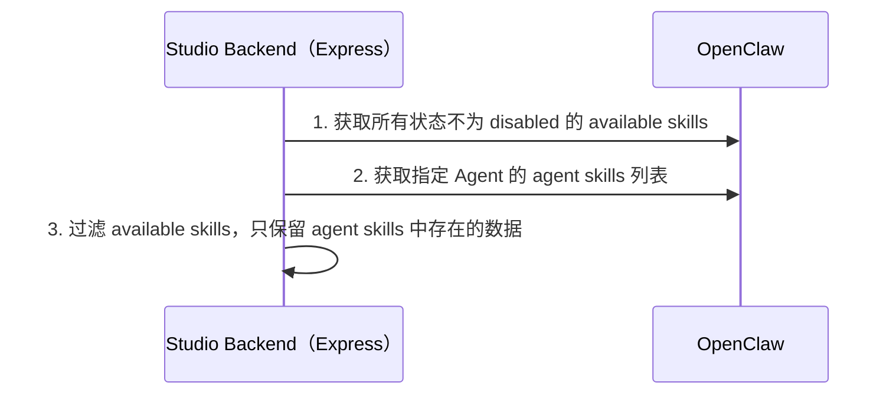

# 列举所有启用状态的 Skill

从 OpenClaw Gateway 获取所有全局的 Skill 列表，并过滤出启用状态的技能，返回给前端用于选择并配置到数字员工。

## Logic

### 获取全局 Skills

读取 @docs/references/openclaw-websocket-rpc/skills.md 获取 WebSocket RPC 接口定义。

### 获取指定 Agent 的 Skills 列表

读取 @docs/references/extensions-gateway-openapi/skills-control.paths.yaml 了解如何获取 agent skills 列表。

## 通过接口获取技能列表

提供 HTTP 接口来获取技能列表。

### 获取 available skills
- GET /dip-studio/v1/skills

### 获取指定数字员工已配置的技能列表
- GET /dip-studio/v1/digital-human/{id}/skills